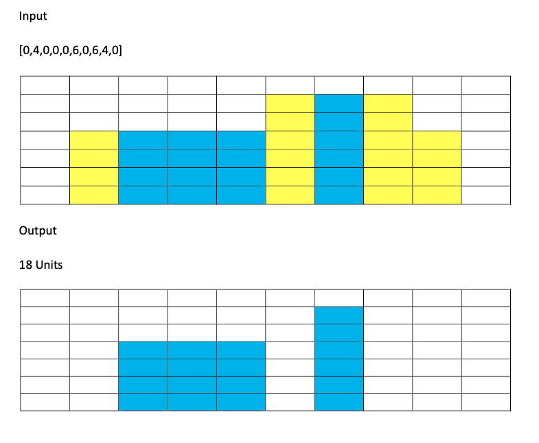

# water-tank-problem
Water Tank Problem (Assignment from [iofactory](iofactory.in))

## Problem Statement

Given `n` always greater than -1, representing the block height. Now compute the units of water stored in-between the blocks. Build a Web Application (Frontend Solution) using Vanilla JavaScript and HTML/CSS to represent the solution.

## Example:

- Input [0,4,0,0,0,6,0,6,4,0]
- Output 18 Units

